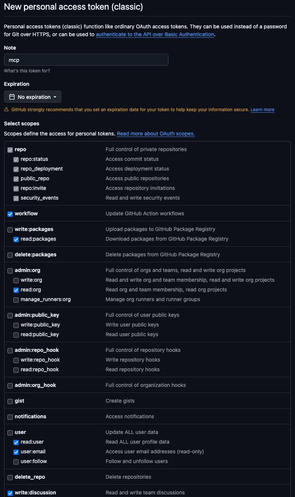

# Setup for MCP servers

Note: at any time, you can check the status of your MCP servers with `claude mcp list`.

## User scoped

Generally applicable MCP servers for any kind of coding project.

### AVOID Github ([doc](https://github.com/github/github-mcp-server/blob/main/docs/installation-guides/install-claude.md))

WARNING: unnecessary context bloat!!! This can be accomplished by `brew install gh`

DO the following ONLY if `gh` can't do what you want.

View, edit, create github content (this is used in place of command line `gh`)

- Generate a (classic) PAT with the specific permissions you want. NOTE that a fine grained one, created properly failed to work on personal repos, even though all permissions and org policies were verified (see pics dir)

  <details>
  <summary>Show permissions</summary>

  

  </details>

- Create the token and add to your lastpass. Add to your `~/.zshrc` as `GITHUB_MCP`
- `source ~/.zshrc`
- Run

  ```sh
  claude mcp add \
    -s user \
    --transport http \
    github \
    https://api.githubcopilot.com/mcp \
    --header "Authorization: Bearer \${GITHUB_MCP}"
  ```

### Context7 ([docs](https://github.com/upstash/context7))

MCP for most up to date libraries (not delayed based on LLM training date) as well as documentation. Reduces hallucinations.

- Create an api key at context7.com and save it in your lastpass. Add to your `~/.zshrc` as `CONTEXT7_API_KEY`
- `source ~/.zshrc`
- Run

  ```sh
  claude mcp add \
    -s user \
    --transport http \
    context7 \
    https://mcp.context7.com/mcp \
    --header "CONTEXT7_API_KEY: \${CONTEXT7_API_KEY}"
  ```

### Playwright ([docs](https://github.com/microsoft/playwright-mcp))

Navigate web pages, take screenshots, generally control a browser.

Easiest to install with `claude mcp add playwright -s user -- npx @playwright/mcp@latest`

### Claude Context ([docs](https://github.com/zilliztech/claude-context))

Index the entire codebase and reduce token usage.

This is run locally via `docker compose`. See the `start.sh` and `stop.sh` commands.

NOTE: You'll need to manually re-index periodically when you want your search results to include recent changes. The system doesn't automatically detect file changes - it uses incremental indexing (via Merkle trees) to make re-indexing efficient, but you still need to trigger it manually when needed.

For active development, consider re-indexing after significant changes or at regular intervals (daily/weekly) depending on how often you modify your codebase.

- Create an [OpenAI API key](https://platform.openai.com/api-keys) dedicated for `claude-context`. Add to your `~/.zshrc` as `OPENAI_API_KEY` - usage is incredibly low, pennies a month.
- `source ~/.zshrc`
- Run

  ```sh
  claude mcp add codeIndexer -s user \
    -e OPENAI_API_KEY=\${OPENAI_API_KEY} \
    -e MILVUS_ADDRESS=127.0.0.1:19530 \
    -e MILVUS_TOKEN=local \
    -- npx @zilliz/claude-context-mcp@latest
  ```

- In your codebase, run prompt `Index this codebase` to kick off indexing for later use.
- You can check on the status by runing `Check the indexing status`
- Example prompt `Find functions that handle user authentication`

### Material UI ([docs](https://mui.com/material-ui/getting-started/mcp/))

Note: verified that that this is deeper/more useful information that adds to the use of `context7` and can be used in addition.

`claude mcp add mui -s user -- npx @mui/mcp@latest`

### Gcloud ([docs](https://github.com/googleapis/gcloud-mcp))

`claude mcp add gcloud -s user -- npx @google-cloud/gcloud-mcp@latest`

### Pulumi ([docs](https://www.pulumi.com/docs/iac/using-pulumi/mcp-server/))

`claude mcp add pulumi -s user -- npx @pulumi/mcp-server@latest stdio`

## Project scoped

Project scoped MCP servers can be shared by a `.mcp.json` file in the root of the project.
