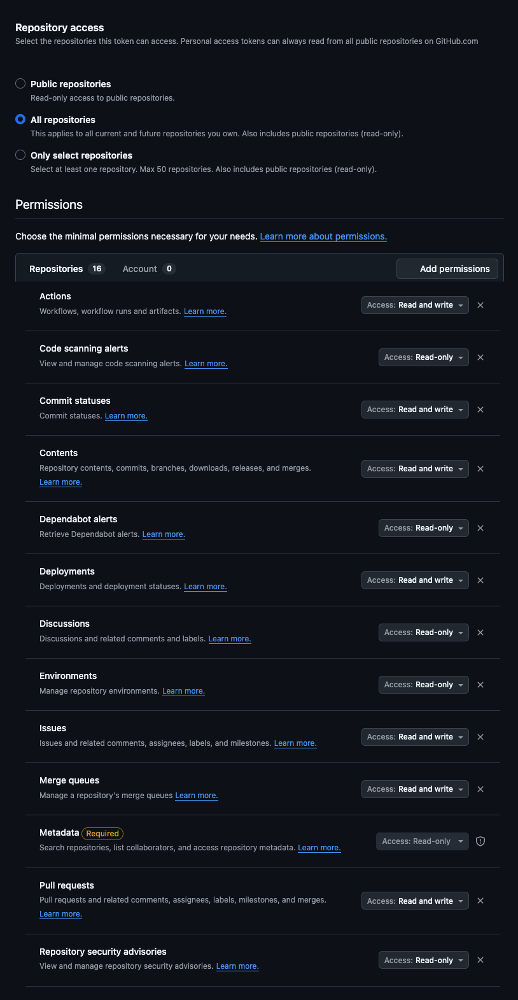

# Setup for MCP servers

## Github
([doc](https://github.com/github/github-mcp-server/blob/main/docs/installation-guides/install-claude.md))

- [Generate a PAT](https://github.com/settings/personal-access-tokens/new) with the specific permissions you want.

  
- Add the token (to your lastpass first) then to `~/.zshrc` as `GITHUB_PAT`
- Add the code block to your  `~/.claude.json` (user level config):

```json
  "mcpServers": {
    "github": {
      "type": "http",
      "url": "https://api.githubcopilot.com/mcp",
      "headers": {
        "Authorization": "Bearer ${GITHUB_PAT}"
      }
    }
  },
```
