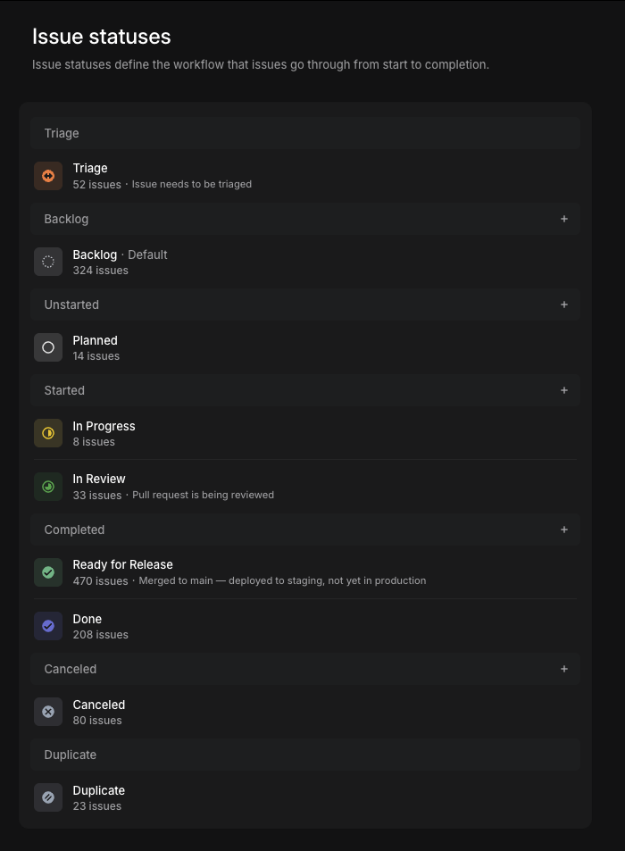

# Set up your own project

This guide takes a fresh Mac from nothing to a working Claude Code setup pointed at **your** GitHub repository and **your** Linear board. The manual part
is short — create the accounts, make a repository, make a Linear team, install a handful of tools — and then **Claude does the rest of the setup for you**
from a single prompt you paste.

**You are not going to be writing code.** You describe the work in Linear; the agents write the code in your repository. That means you do **not** need
Docker, a database, or a running copy of an app to get started — this guide deliberately skips all of it.

Read this guide in your browser on GitHub so you can copy from it before the machine is set up.

**If anything goes wrong:** stop and take a screenshot of the whole window, including the command you ran. Paste it into Claude — [claude.ai](https://claude.ai)
in the browser until Step 5, and the Claude pane in VS Code after that — and ask what happened. Nothing in this guide is dangerous to re-run; if you are
unsure whether a step worked, doing it again is safe.

## Placeholders used below

Replace these wherever they appear before running anything:

| Placeholder | What to put |
| --- | --- |
| `<Your Name>` | Your full name, e.g. `Jane Smith` |
| `<your.email@foo.com>` | The email address on your GitHub account |
| `<account>` | Your GitHub username or organization, e.g. `janesmith` |
| `<project>` | A short, lowercase name for the project, e.g. `acme-app` |
| `<TEAM>` | Your Linear team key — the prefix on every issue, e.g. `ACME` |

## Step 0 — Accounts

Three accounts. Create each one in your browser and leave the tabs open:

1. **GitHub** ([github.com](https://github.com)) — where the code lives.
2. **Claude** ([claude.ai](https://claude.ai)) — the AI assistant this whole workflow runs on. Claude Code needs a **paid plan (Pro or Max)**; set that up
   while you are signing in, or the agents will run out of usage almost immediately.
3. **Linear** ([linear.app](https://linear.app)) — where the work is tracked. Create a workspace if you don't already have one.

## Step 1 — Create your GitHub repository

In the browser, at [github.com/new](https://github.com/new):

1. **Owner** — your account (or your organization).
2. **Repository name** — `<project>`.
3. **Private** — unless you have a reason to make it public.
4. Tick **Add a README file**. This gives the repository its first commit; a completely empty repository has no branch yet and the tools have nothing to
   clone.
5. **Create repository**.

Already have a repository you want to use? Skip this step and use its name as `<project>` from here on.

## Step 2 — Set up your Linear team

Linear is not a status report the agents write to — it is the **control plane they read from**. What you put on the board decides what gets built next, so
this step matters more than it looks. [Linear for stakeholders](linear-for-stakeholders.md) explains the whole model; right now you just need a team whose settings match what the skills expect.

**Create the team.** In Linear: Settings → **Teams** → new team, named after your project. Note its **key** — the short prefix Linear puts on every issue,
e.g. `ACME-1`. That key is `<TEAM>` in the rest of this guide. Then make the two changes below, both under Settings → your team.

### Turn on Triage

**Triage** → enable it. (Linear may require a paid plan for this.)

Triage is the inbox for anything that has not been accepted for work yet — an idea you dropped in, a bug someone reported. Agents never pick anything up from
it; `/spec` is what drains it, moving each issue into `Planned` as it certifies it. Without Triage, every raw idea lands directly in the working backlog.

### Match the issue statuses

**Issue statuses** → edit them to match this:



That is Linear's default workflow with two changes:

| Change | Group | Why |
| --- | --- | --- |
| Rename `Todo` to `Planned` (deleting `Todo` and adding `Planned` does the same thing) | Unstarted | `/spec`, `/start`, and `/auto` all write the literal status `Planned` — it is where an agent moves an issue it accepts out of Triage, and where it parks one that turns out to need your decision. A team that only has `Todo` fails those writes |
| Add `Ready for Release`, positioned **above** `Done` | Completed | Where an agent leaves an issue once the code is written, reviewed, and merged but not yet released. Without it, finished work has nowhere to go and every issue stalls at the last step |

Everything else is Linear's default and stays as it is: `Backlog`, `In Progress`, `In Review`, `Done`, `Canceled`, `Duplicate`.

The labels the agents match on get created for you in Step 6, which also checks both of these statuses and tells you if either is missing.

## Step 3 — Install the tools

Open **Terminal** (press `Cmd`+`Space`, type `terminal`, Enter) and run these one at a time, waiting for each to finish. Accept the defaults everywhere.

1. **Apple's command-line tools** — this is what provides `git`:

   ```bash
   xcode-select --install
   ```

   A dialog appears — click **Install** and wait for it to finish. If it says the tools are already installed, that's fine, move on.

2. **Homebrew** — the macOS software installer everything else comes from:

   ```bash
   /bin/bash -c "$(curl -fsSL https://raw.githubusercontent.com/Homebrew/install/HEAD/install.sh)"
   ```

   It asks for your Mac password — as you type it, nothing appears on screen; that's normal. When it finishes it prints a short **"Next steps"** section with
   one or two commands to run. **Run those commands** — they are what puts `brew` on your PATH.

3. **VS Code and the GitHub command-line tool**:

   ```bash
   brew install --cask visual-studio-code
   brew install gh
   ```

4. **Claude Code** itself:

   ```bash
   curl -fsSL https://claude.ai/install.sh | bash
   ```

**Now close Terminal and open a new one** (the PATH changes above only apply to new windows), then confirm Claude answers:

```bash
claude --version
```

Everything else — Node, pnpm, the Linear command-line tool — Claude installs for you in Step 6.

## Step 4 — Sign in to GitHub and get the project

In that new Terminal window:

```bash
gh auth login
```

Answer the questions it asks: **GitHub.com** → **HTTPS** → **Yes** (authenticate Git with your GitHub credentials) → **Login with a web browser**. It shows
you a one-time code, then opens your browser — paste the code there and approve. Say yes to authenticating Git; that is what lets the next command work.

```bash
mkdir -p ~/projects
gh repo clone <account>/<project> ~/projects/<project>
```

When it finishes, close Terminal.

## Step 5 — Open the project and the Claude pane

1. Open VS Code → **File → Open Folder** → choose `projects/<project>` in your home folder.
2. If a notification offers to **install the recommended extensions**, click **Install**. (A brand-new repository won't have any — that's fine.)
3. Install the **Claude Code** extension: Extensions icon in the left bar → search "Claude Code" (publisher: Anthropic) → **Install**.
4. **Open the Claude pane:** click the **Claude icon** that now appears in the Activity Bar on the left edge of VS Code. The first time, it walks you
   through signing in — use your Claude account from Step 0.
5. **Set the permission mode to Auto:** near Claude's message box there is a permission-mode control (it may say *Default*). Switch it to **Auto**. This
   lets Claude run the setup commands itself instead of stopping to ask your approval for every one.

## Step 6 — Let Claude finish the setup

Copy the entire block below, **replace the placeholders** with your name, email, and Linear team key, and paste it into the Claude pane as one message.
Claude will work through it, telling you what it's doing; a couple of steps open a browser window for you to approve a sign-in. If the conversation goes
sideways or stops partway, it is safe to paste the same prompt again — it picks up where things left off.

```text
Set up this machine for working on this repository with Claude Code. I'm not a developer and I won't be
writing code — I describe work in Linear and the agents implement it. Explain what you're doing in plain
language, one thing at a time, and when a step needs me to sign in or run something myself, give me the
exact thing to do and wait until I say it's done.

1. Configure git globally: user.name "<Your Name>", user.email "<your.email@foo.com>".
2. Install Node and pnpm via Homebrew, then run `pnpm setup`. Verify with: node --version and
   pnpm --version.
3. Make ~/.claude a checkout of https://github.com/alienfast/claude.git on branch main, and pull the
   latest. It may already exist with files in it — set it up in place; don't delete anything.
4. Run: bash ~/.claude/update.sh — and get it to finish successfully. If it stops for an interactive
   sign-in (gh auth login, or the Linear browser OAuth), tell me exactly what to do, wait for my
   confirmation, then re-run the script. Repeat until it ends with "Done!".
5. Verify Linear: linear-cli teams list — it should list my team, <TEAM>. If it doesn't, run
   linear-cli auth oauth (a browser window opens for me to approve) and check again.
6. Create the issue labels the workflow matches on. For each of: specified, needs decision, human,
   solo, simple, epic, reflection, stalled, security, bug — check `linear-cli labels list -t issue`
   first and create only the missing ones with `linear-cli labels create "<name>" -t issue`.
7. Confirm my team has both of the workflow statuses the skills write by name:
   linear-cli statuses list -t <TEAM> should show "Planned" (type unstarted) and "Ready for Release"
   (type completed, positioned before Done). If either is missing, create it through the Linear API
   (a workflowStateCreate mutation) — or, if that doesn't work, tell me exactly where to add it in
   Linear's team settings.
8. Pin the team scope for this project: in this repository, create or edit .claude/settings.json so it
   sets the env variable LINEAR_TEAM to <TEAM>. Commit that file.
9. Verify GitHub: gh auth status — it should show me signed in to github.com.
10. Do NOT set up a local application stack — no Docker, no database, no dev server. I only need the
    repository, Linear, and the agent tooling.
11. Finish with a short checklist: everything that's verified working, and anything that still needs my
    attention.
```

When Claude's final checklist is all green, the machine is ready.

## Step 7 — Working with Claude from here

Everything happens in the Claude pane in VS Code, in plain English.

### Staying up to date — do this first, every day

**Start each day by typing `/update` in the Claude pane.** It pulls the latest code and the latest agent configuration, then re-runs the setup script from
Step 6. It takes a minute or two, it is safe to run any time, and it fixes most "tool not found" problems. Restart VS Code afterwards when it tells you to —
new commands and skills are only picked up at startup.

### Your first issues

For a brand-new project, work top-down: describe the idea, let Claude turn it into issues, certify one, then let it build.

| What you want | What to type |
| --- | --- |
| Turn an idea into a set of Linear issues | `/prd` and describe what you want built, or point it at a document |
| Turn one existing issue into a build-ready spec | `/spec` — it interviews you and certifies the issue |
| Build one issue end to end, with you approving the plan | `/full wt <TEAM>-1` |
| Build one issue unattended | `/auto <TEAM>-1` |

`/spec` is the one command worth knowing on day one. Only issues it has certified (they carry the `specified` label) are eligible for unattended work — that
gate is the whole safety model. Type `/spec` on its own and it offers up the issues most in need of it.

You can also just ask questions — *what's on the board right now?*, *what would you build first?* — and Claude will read the repository and Linear to answer.

**If your repository is still empty**, make the first issue the one that stands the project up: ask Claude to *set up a new TypeScript project here using the
house tooling conventions*. The agents' review gate runs the project's own checks before anything ships, so there needs to be a project for it to check.

### Worth reading once

- **[Linear for stakeholders](linear-for-stakeholders.md)** — start here. Which labels, states, and priorities decide what gets built next, and how to
  influence them. This is the document that explains why `/spec` matters.
- **[Claude Code User Configuration](README.md)** — the full reference for every command and skill available to you, including the ones you won't use. Skim
  the headings so you know what exists; come back when you need one. The [fleet section](README.md#3-ship-with-a-fleet) is what you graduate to once the
  board has more certified work than you want to babysit.
